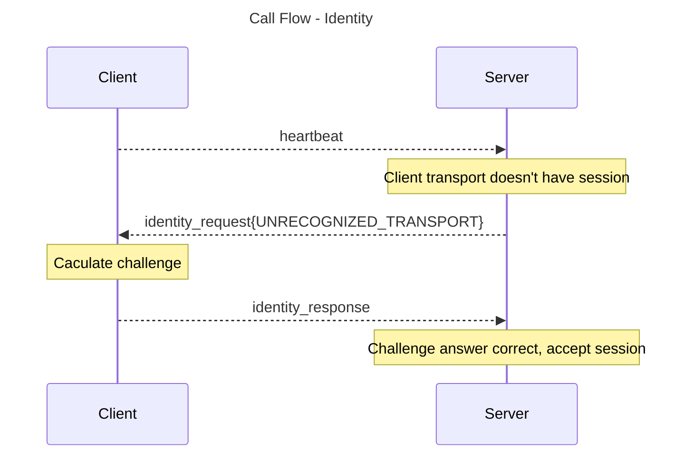
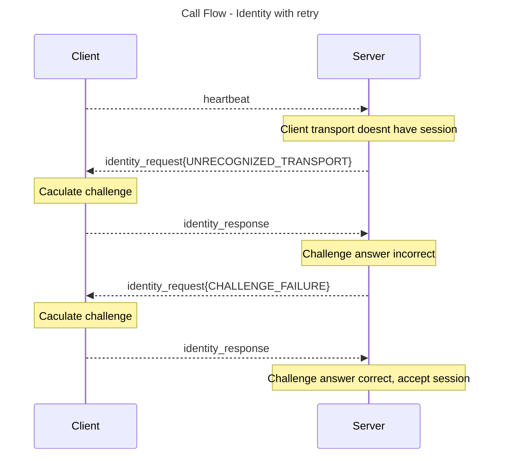

Definitions:
* tranport - udp socket (source address and port)

Messages:

heartbeat
* client initiated
* timeout is configured with switch.client_idle_timeout_m
* if timeout is reached, switch will delete the session associated with the transport identity
* recommended to send switch.client_idle_timeout_ms/5 after last message
* server will send his hearbeat

identity_request
* server initiated
* server generate random session and challenge_request, and cache it then associat it to the transport identity

identity_response
* client response
* matched via request_id
* verify the challenge_response based on the original challenge_request and username
* session_to_use - server will create new session, if session already exist and the owner is the same user, just update its transport address. 

create_request
* client initiated
* create a channel
* server shall store metadata for the channel
* server shall apply the limits (and config limits)

create_response
* server response
* fail if channel name already exist

join_request
* client initiated
* identifies channel by name (and metadata must match)
* server shall remember client session in the channel

join_response
* server response
* returns channel_id and optional limits on success
* fails if channel name is unknown or metadata does not match the channel

leave_request
* client initiated
* server will remove client session in the channel

leave_response
* server response
* fails if client session is not in the channel

stream_data
* client initiated, server forwarded
* server will distribute stream_data (and fill the client username), to all session's transport in the channel
* session can be destroyed anytime, in this case server can perform lazy cleanup triggered by a missing session

ignored_indication
* server initiated
* use to indicate that server is dropping the message

server will drop stream_data message if not login or not joined